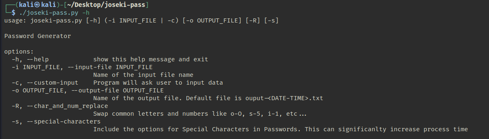
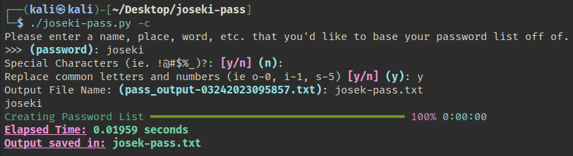
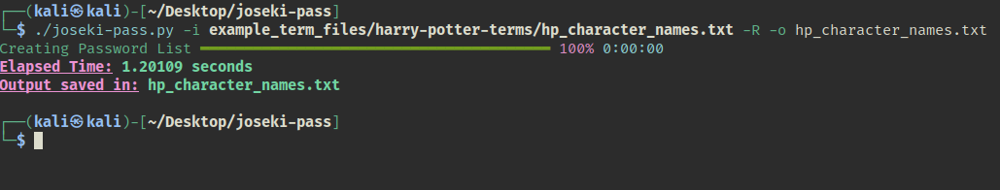

# joseki-pass

## Description
The purpose of this project is to create a basic password list.
A word list of terms needs to have already been created.
This program will then create a password file from it.

---
## How to Execute
**Setting up the script**
```bash
git clone https://gitlab.com/ka5pyr/joseki-pass.git
cd joseki-pass
chmod u+x joseki-pass
```

**Installing Dependencies**
```bash
pip install rich
```

**A look at the help page**
```bash
python3 joseki-pass -h
./joseki-pass -h
```


**Executing the script with an input file**
```bash
./joseki-pass -c
```


**Executing the script with an input file**
```bash
./joseki-pass -i <termfile.txt> -o <outfile.txt>
```


---
## To Do
- [x] Add a time tracker function to display how long the command took to complete
- [x] Add Command Line Arguments
    - [x] Choose Output filename
    - [x] Help Page
- [x] Add possible rich tracker
